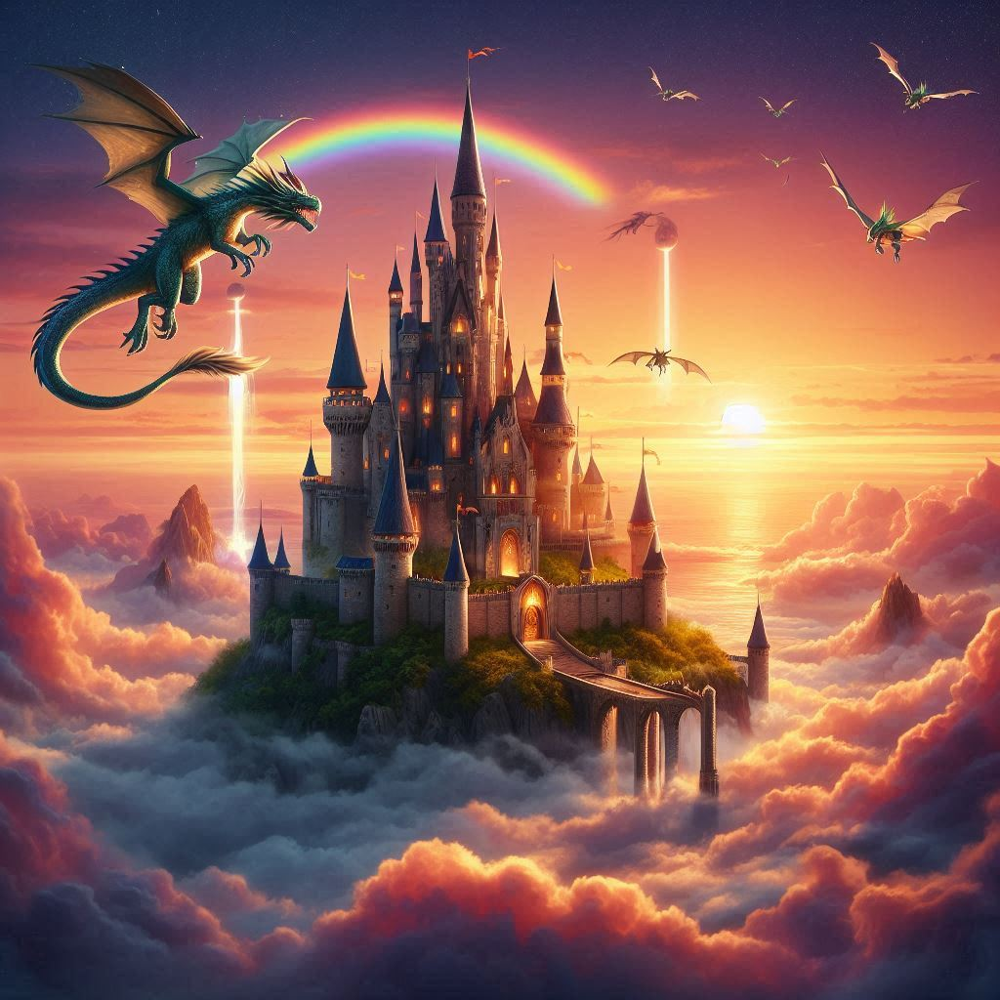
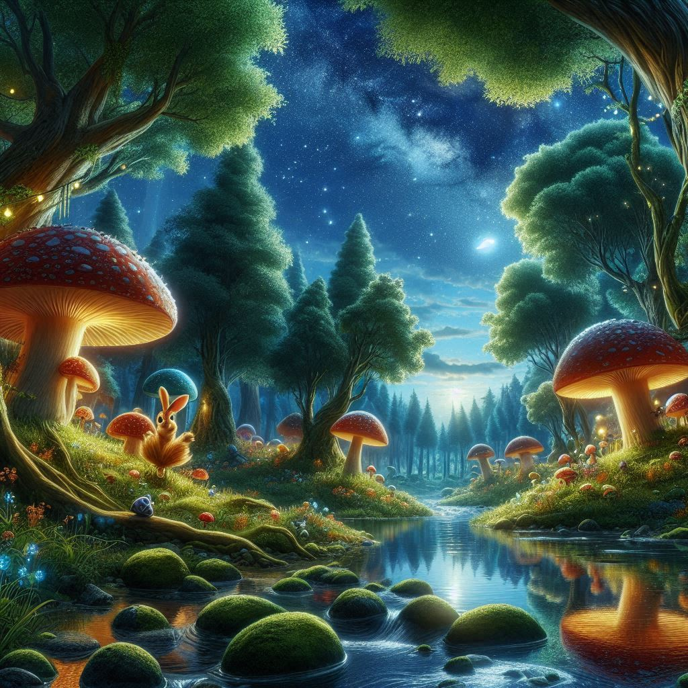
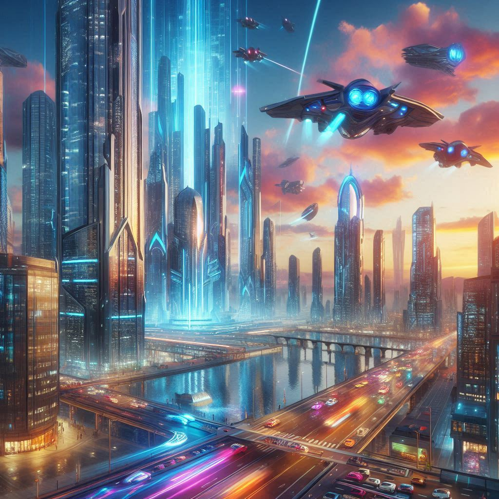

# Projeto de Geração de Imagens com IA

## Descrição

Este projeto demonstra o uso de uma Inteligência Artificial generativa para criar imagens personalizadas baseadas em descrições fornecidas pelo usuário. As imagens foram geradas com base em diferentes contextos criativos, cada uma representando cenários únicos e imaginativos. 

## Objetivo

Explorar o potencial das tecnologias de IA para transformar ideias abstratas em representações visuais vívidas, promovendo criatividade e inspiração.

## Imagens Criadas

1. **Castelo Flutuante sobre as Nuvens**  
   Contexto: Um castelo flutuante sobre nuvens iluminadas por um pôr do sol, com dragões voando ao redor e um arco-íris distante.  
   

2. **Floresta Mágica**  
   Contexto: Uma floresta mágica com árvores brilhantes, cogumelos gigantes e um riacho de águas cristalinas que reflete o céu estrelado.  
   

3. **Cidade Futurista no Estilo Cyberpunk**  
   Contexto: Uma cidade futurista com arranha-céus de vidro reluzente, veículos voadores e um céu cheio de cores vibrantes ao estilo cyberpunk.  
   

## Ferramenta Utilizada

As imagens foram criadas utilizando uma IA generativa avançada, como o Copilot, capaz de interpretar descrições detalhadas e transformá-las em imagens digitais de alta qualidade.

## Instruções para Recriação

1. Forneça uma descrição detalhada do cenário que deseja criar.
2. Utilize uma ferramenta de geração de imagens com IA para transformar a descrição em uma imagem visual.
3. Ajuste ou refine a descrição conforme necessário para obter o resultado desejado.

## Conclusão

Este projeto ilustra como a IA pode ser uma poderosa aliada no processo criativo, permitindo a visualização de conceitos abstratos e promovendo a expressão artística de forma acessível e eficiente.

---

Sinta-se à vontade para contribuir ou adaptar este projeto para explorar ainda mais as possibilidades da geração de imagens com IA!
